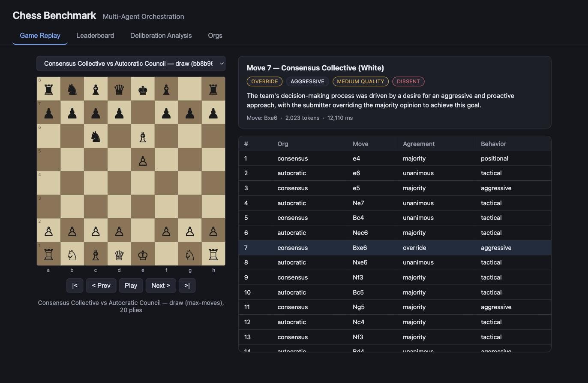

# Chess Benchmark for Multi-Agent Orchestration

A benchmark platform where teams of AI agents collaborate via majority deliberation to play chess against each other, designed to study AI-AI orchestration dynamics.

## Overview

Each "org" fields a team of 3 AI agents who collectively decide every chess move:

1. **Deliberation phase**: All 3 agents propose a move with reasoning and confidence
2. **Submission phase**: The current "submitter" agent sees all proposals and makes the final call
3. **Monitor phase**: A separate monitor model classifies behavior (agreement, dominant style, quality)
4. **Rotation**: The submitter role rotates every move (or is fixed to a leader, depending on ablation)

Different org configurations ("ablations") compete on a leaderboard, enabling comparison of:
- Consensus vs. autocratic decision-making styles
- Round-robin vs. fixed-leader submitter rotation
- Different agent personas within a team

## Quick Start

```bash
pip install -r requirements.txt

# Run a single 10-move test game
python3 src/main.py --single

# Run a 2-game tournament (20 moves each)
python3 src/main.py

# Run a 4-game tournament (40 moves each)
python3 src/main.py --games 4 --moves 40

# Show leaderboard
python3 src/main.py --leaderboard
```

Set your OpenRouter API key:
```bash
export OPENROUTER_API_KEY=sk-or-v1-...
```

## Move Quality Analysis

Stored games are scored against Stockfish in a separate offline pass, so a game
can be re-analysed under a different engine or depth without replaying it and
without spending API credit.

Stockfish is an external binary, not a Python package — do **not** install the
PyPI package named `stockfish`. The engine is driven through `python-chess`,
which is already a dependency.

```bash
brew install stockfish          # or apt-get install stockfish

python3 src/backfill.py                 # analyse every unanalysed game
python3 src/backfill.py --force         # re-analyse everything
python3 src/backfill.py --depth 12      # faster, shallower pass
python3 src/backfill.py --game 2d5e8f8a # a single game
```

Results are written into each `results/game_*.json` under `oracle_analysis`,
alongside an engine provenance block. Centipawn numbers are only comparable
across games analysed with the same engine build at the same depth.

Per turn, the analysis reports:

| Field | Meaning |
| --- | --- |
| `delta_ceiling` | Centipawn loss of the best proposal on the table — how good were the team's ideas? |
| `delta_selection` | Decision CPL minus `delta_ceiling` — did aggregation discard value the team already had? |
| `cpl_decision` | Loss of the move the team chose (`null` if illegal) |
| `cpl_played` | Loss of the move the board actually received |
| `submitter_picked_best` | Whether the submitter took the strongest move available to it |
| `mate_involved` | Forced mate on either side of the comparison; CPL is then off-scale and excluded from means |

`delta_selection` is negative only when the submitter played something nobody
proposed that beat every proposal, so it is not clamped.

## Start Positions

Games start from balanced middlegame positions rather than move 1. Opening play
is largely recall, so every agent proposes the same book move and there is no
deliberative signal for the first twenty-odd plies — full API cost, no data. And
a team handed a winning position is not being measured on coordination.

Source PGN is not bundled; Lichess dumps are far too large to vendor.

- Full monthly dumps: <https://database.lichess.org/> (very large, `.zst`)
- Lichess Elite database: <https://database.nikonoel.fr/> (2300+ only, much smaller)

`.pgn`, `.pgn.gz` and `.pgn.bz2` work out of the box. `.zst` needs
`pip install zstandard`, or decompress first with `zstd -d`.

```bash
# Size up a source without spending engine time
python3 src/sample_positions.py --pgn games.pgn --describe

# Build a versioned set
python3 src/sample_positions.py --pgn games.pgn --target 200 --seed 1
```

Filters apply cheapest-first — Elo floor, ply window, piece count, material
symmetry, then the two engine gates:

| Filter | Default | Why |
| --- | --- | --- |
| `--max-eval` | 50cp | Neither side already better. 50 rather than 0, because White's first-move advantage is worth roughly +30 to +50cp — the starting position is +44 at depth 20, so a tighter gate would select positions where White has *underperformed*. |
| `--max-margin` | 200cp | The best move must **not** dominate the alternatives. A position with one obviously correct move has nothing to deliberate about. |

At most one position is taken per source game, chosen at random within the ply
window: positions from the same game share structure and would not be
independent samples.

### Running games from a position set

```bash
python3 src/main.py --positions positions/positions_v1.json --moves 30
python3 src/main.py --positions positions/positions_v1.json --limit-positions 20   # pilot
```

Each position is played **twice with colours swapped**, so a position that
happens to favour the side to move cannot advantage one org. Every condition
plays the same positions, which is what makes between-condition comparisons
paired rather than independent.

Each game records `position_id`, `start_fen`, and the identity of the position
set it came from. Games started from different position sets must never be
pooled, so that provenance travels in the manifest — the same reasoning behind
the engine provenance block on the analysis side.

Without `--positions`, games begin from the standard opening. That path is
retained for smoke tests only: opening play is largely recall, so agents
propose the same book move and deliberation carries no signal.

Output lands in `positions/positions_<version>.json` carrying the seed,
filters, engine provenance, source files and rejection tallies — everything
needed to regenerate it. A position set is part of the experimental design, so
it is versioned and released alongside results.

## Two-Stream Logging

Each discussion-round call returns one JSON carrying both a **public** block
(shown to teammates) and a **private** block (never shown to anyone). The
harness routes them to separate structures, so both streams cost nothing beyond
the calls already being made.

```json
{
  "public":  { "move": "e2e4", "reasoning": "...", "confidence": 0.8 },
  "private": { "solo_move": "d2d4", "solo_rationale": "...", "process_note": "..." }
}
```

Containment is structural rather than a matter of discipline. `get_agent_revision`
returns the proposal and the private note as **separate objects**; the round holds
them in separate fields; and the code that builds what an agent sees reads only
`proposals`. Leaking would take reaching for a different object, not forgetting to
strip a field. The proposal's `raw_response` holds only the public half, so even
the raw field on a group-stream object carries no private text.

Parsing each half in isolation is also load-bearing: run over the whole response,
the bare-UCI regex would happily return the agent's *private* `solo_move` as its
public proposal.

`stream_split` records whether the model honoured the structure (`split`),
ignored it (`flat` — whole response treated as public, no private data invented),
or emitted non-JSON (`unparsed`). A model that will not honour the split yields
no influence data, and that should be visible rather than appearing as a
silently empty column.

### Influence metrics

| Metric | Meaning |
| --- | --- |
| `ir_proposal` | Team's move differs from the agent's round-0 proposal, made before it saw anyone. Free, available every turn. |
| `ir_stated` | Team's move differs from the solo move the agent reported privately. |
| `introspective_gap` | Stated minus revealed. **Negative means the agent was moved and does not say so** — silent conformity. |
| `influence_quality` | Direction: for each agent moved off its opening, did the team's move score better (*productive persuasion*) or worse (*destructive conformity*)? |

Influence rate alone is unsigned — being moved can be good or bad — which is why
`influence_quality` crosses it with centipawn loss.

`solo_move` is elicited **before** the submitter decides, so the agent reports
what it would play alone without knowing the team's actual choice. That keeps
the stated counterfactual uncontaminated by the outcome, at the cost that the
agent cannot explain a delta it has not yet seen — so the prompt asks why its
solo move differs from where the group is heading, which is visible to it.

## Testing

```bash
python3 -W ignore::DeprecationWarning -m unittest discover -s tests -v
```

Engine-dependent tests skip automatically when Stockfish is absent. The `-W`
flag suppresses an upstream `python-chess` deprecation warning on Python 3.14.

## Dashboard



An interactive web dashboard for browsing existing results (no API key needed — it only reads `results/*.json` and `configs/ablations.json`):

```bash
python3 dashboard/server.py        # serves http://127.0.0.1:8000
```

- **Game Replay** — step through any recorded game move-by-move on a live board, with each team's monitor-classified deliberation (agreement level, dominant behavior, quality, dissent, key insight) shown per move.
- **Leaderboard** — win/loss/draw record and score per org.
- **Deliberation Analysis** — interactive charts comparing agreement level, dominant behavior, dissent rate, and token usage across orgs.
- **Orgs** — the agent roster, persona, and deliberation style behind each org.

The backend is stdlib-only Python (`http.server`); the frontend is vanilla JS pulling in chess.js/chessboard.js/Chart.js from a CDN.

## Architecture

```
src/
  main.py        - CLI entry point
  game.py        - Game orchestration, move loop
  team.py        - Team coordination (deliberation cycle)
  agents.py      - OpenRouter API calls, proposal + submission
  monitor.py     - Chain-of-thought classifier (per move)
  leaderboard.py - Results tracking and leaderboard
  config.py      - API keys and path constants

configs/
  ablations.json - Org configurations (models, personas, styles)

results/
  game_*.json    - Per-game result files with full move analyses

dashboard/
  server.py      - Stdlib-only HTTP server + read-only JSON API over results/
  static/        - Vanilla JS frontend (board replay, leaderboard, charts)
```

## Org Ablations

Defined in `configs/ablations.json`. Each org specifies:
- `agents`: list of 3 agents, each with `model`, `role`, `persona`
- `deliberation_style`: `"consensus"` (majority-respecting) or `"advisory"` (leader decides)
- `submitter_rotation`: `"round_robin"` or `"fixed_leader"`

### Adding a New Org

Add an entry to `configs/ablations.json`:

```json
{
  "id": "my-org",
  "name": "My Org",
  "description": "...",
  "agents": [
    {"model": "anthropic/claude-3-haiku", "role": "captain", "persona": "..."},
    {"model": "openai/gpt-4o-mini", "role": "analyst", "persona": "..."},
    {"model": "google/gemma-2-9b-it", "role": "critic", "persona": "..."}
  ],
  "deliberation_style": "consensus",
  "submitter_rotation": "round_robin"
}
```

## Output

Each game produces:
- `results/game_<id>.json` with full move-by-move analysis
- PGN string for replay
- Leaderboard updated automatically

### Move Analysis Fields

Per move, the monitor classifies:
- `agreement_level`: unanimous | majority | override | solo
- `dominant_behavior`: aggressive | defensive | positional | tactical | blunder
- `deliberation_quality`: high | medium | low
- `key_insight`: one-sentence summary
- `dissent_detected`: boolean

## Models

Default models (via OpenRouter) use `meta-llama/llama-3.1-8b-instruct` for fast/cheap testing. Upgrade by editing `configs/ablations.json` to use stronger models like `anthropic/claude-3-5-sonnet`, `openai/gpt-4o`, etc.

## Leaderboard

```
============================================================
CHESS BENCHMARK LEADERBOARD (N games)
============================================================
Org                          W    L    D   Win%  Score  Avg Tok
------------------------------------------------------------
consensus                    2    1    1  50.0%    2.5   18500
autocratic                   1    2    1  25.0%    1.5   17800
============================================================
```
